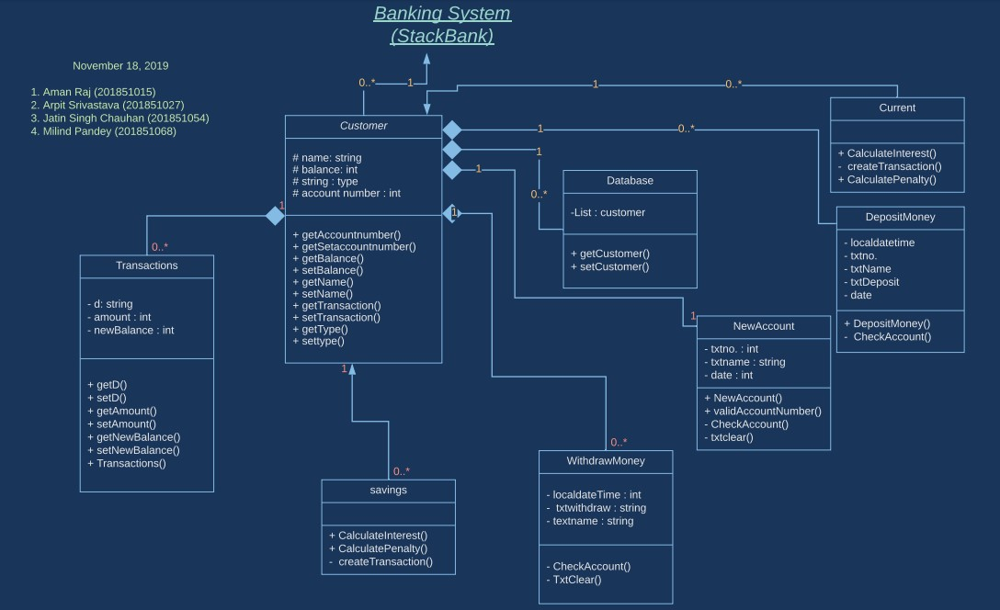
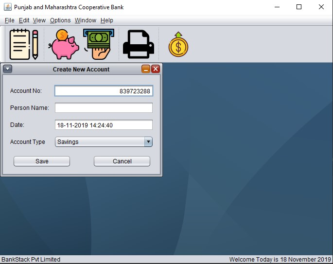

<h1 align="center">Stack Bank</h1>

> OOPS project made for course CS261 

**A banking management build upon the priniciples of Core Java and Object Oriented Programming.**

### How to Run
1. Install the Maven dependencies. 
2. Run TestFrame.java 

### UML Diagram 

### How project looks after running 

### Contributors
 |  |  |  |
---|---|---|---|
[Aman Raj](https://github.com/amanraj1608) | [Arpit Srivastava](http://github.com/fuzious) |  [Jatin Singh Chauhan](https://github.com/jatin0406) | [Milind Pandey](http://github.com/Pranshu2780) |  

